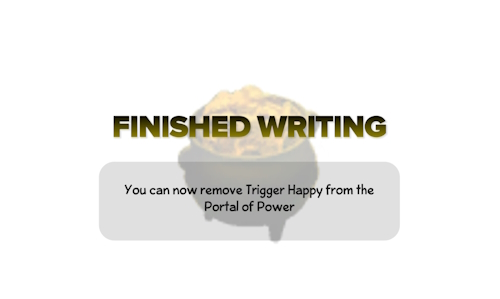

# [Riches](https://github.com/Texthead1/Riches) (Texthead)

A simple application to max out the gold of Skylanders figures.

---

1. Download the latest ZIP release from **[here](https://github.com/Texthead1/Riches/releases/)**.
2. Extract the archive wherever you like.
3. Download the `salt.txt` file from **[here](https://github.com/skylandersNFC/skylandersNFC.github.io/blob/main/SkyTools/Riches/salt.txt)**.  
   - If you can’t find the download button, pressing `Ctrl` + `Shift` + `S` will do the trick.
4. Assuming you've extracted the ZIP into a folder like `vX.X.X`, go into it, then navigate to the `Riches_Data` folder.  
   - Inside that, create a `StreamingAssets` folder and drop the `salt.txt` file there.
5. Plug in your Wii/PS3 Portal of Power.
6. Download the latest version of [Zadig](https://zadig.akeo.ie/) and launch it.  
   - Zadig replaces the Portal of Power’s driver to make it work with `Riches`.  
   - **This will NOT change the firmware or harm the portal in any way.**
7. In `Zadig`, go to `Options` → `List All Devices`.
8. From the dropdown, select **`Spyro Porta`**.  
   - **Be sure to select `Spyro Porta`!**  
   - Some people accidentally overwrite the driver for the first listed device (usually their mouse), which will stop it from working until you manually restore it.
9. With `Spyro Porta` selected, look to the right of the green arrow - where the current driver is shown.  
   - Change the driver from `WinUSB` to **`libusbK`**.
10. Only if you’ve followed all steps correctly, click **`Replace Driver`**.  
    - This may take a moment.
11. If the driver switch to `libusbK` was successful, start `Riches.exe`.
12. When you see the prompt `Please place a Skylander on the Portal of Power`, do just that.  
    - The Skylander will instantly receive **65535** gold.

---
