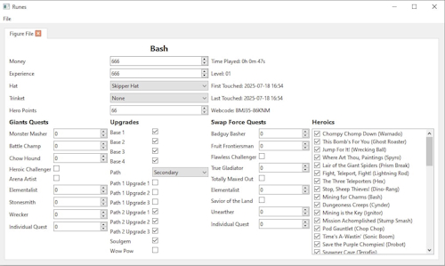

# [Runes](https://github.com/NefariousTechSupport/Runes) (NefariousTechSupport)

A Skylanders dumps GUI editor.

---

1. Download the latest version of the ZIP archive from **[here](https://github.com/NefariousTechSupport/Runes/releases)**.
2. Extract the archive wherever you like.
3. Download the `salt.txt` file from **[here](https://github.com/skylandersNFC/skylandersNFC.github.io/blob/main/SkyTools/Runes/salt.txt)**.  
   - If you can’t find the download button, pressing `Ctrl` + `Shift` + `S` will do the trick.
4. Assuming you've extracted the Runes ZIP archive to a folder called `Runes-win64-vX.X.X`, navigate into it, then into the `Resources` subfolder, and place the `salt.txt` file there.
5. Start `Runes.exe`, go to the `File` menu, and click `Open`.  
   - You can also use the shortcut `Ctrl` + `O`.
6. Select your Skylanders dump file.  
   - If you don’t have any dumps, check out the **[Ultimate NFC Pack](https://skylandersnfc.github.io/Skylanders-Ultimate-NFC-Pack/)**.
7. Follow the GUI menu - everything is pretty self-explanatory.
8. When finished, go to the `File` menu again and choose `Save`.  
   - Or just press `Ctrl` + `S`.
9. To save your modified dump, give it a new name.  
   - For example, if you were editing `Bash.dump`, you might name the modified version `Bash_Enhanced.dump` - or whatever you prefer.
10. That’s it!  
    - Write the modified dump to your NFC tag or use it directly in an emulator.
   
   ---
